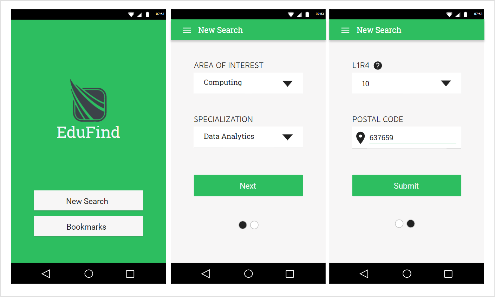
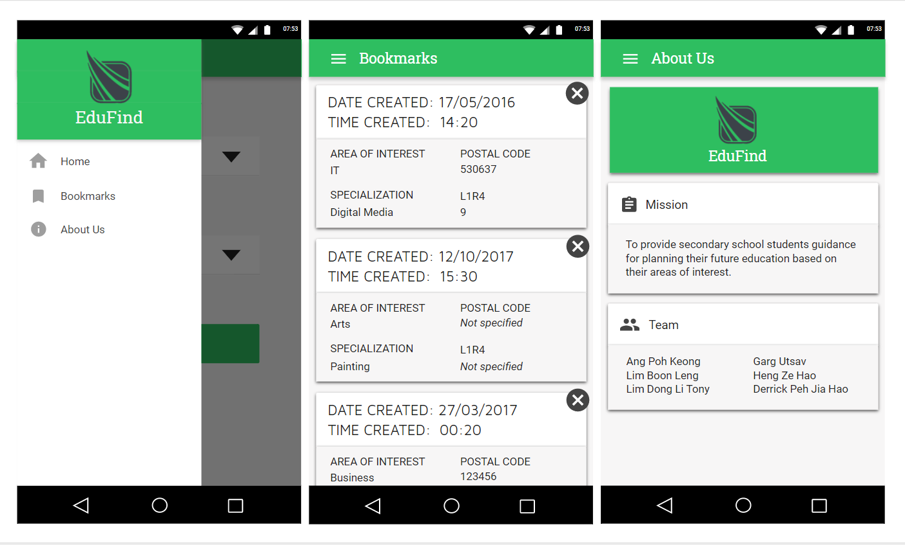
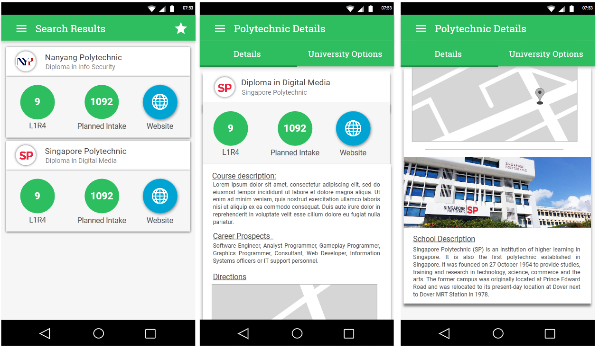

# Edufind

An android application developed as a project for a Software Engineering course. The application provides guidance to
students planning to enrol in a polytechnic institutions based on their areas of interest.

## Screenshots

